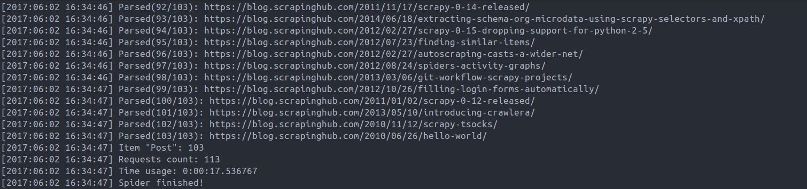

# 

[](https://travis-ci.org/gaojiuli/gain)
[](https://pypi.python.org/pypi/gain/)
[](https://pypi.python.org/pypi/gain/)
[](https://pypi.python.org/pypi/gain/)

Web crawling framework for everyone. Written with `asyncio`, `uvloop`, `aiohttp` and `aiocache`.


## Requirements

- Python3.5+

## Installation

`pip install gain`

`pip install uvloop` (Only linux)

## Usage

1. Write spider.py:

```python
from gain import Css, Item, Parser, Spider
import aiofiles

class Post(Item):
    title = Css('.entry-title')
    content = Css('.entry-content')

    async def save(self):
        async with aiofiles.open('scrapinghub.txt', 'a+') as f:
            await f.write(self.results['title'])


class MySpider(Spider):
    concurrency = 5
    headers = {'User-Agent': 'Google Spider'}
    start_url = 'https://blog.scrapinghub.com/'
    parsers = [Parser('https://blog.scrapinghub.com/page/\d+/'),
               Parser('https://blog.scrapinghub.com/\d{4}/\d{2}/\d{2}/[a-z0-9\-]+/', Post)]


MySpider.run()
```

Or use XPathParser:

```python
from gain import Css, Item, Parser, XPathParser, Spider


class Post(Item):
    title = Css('.breadcrumb_last')

    async def save(self):
        print(self.title)


class MySpider(Spider):
    start_url = 'https://mydramatime.com/europe-and-us-drama/'
    concurrency = 5
    headers = {'User-Agent': 'Google Spider'}
    parsers = [
               XPathParser('//span[@class="category-name"]/a/@href'),
               XPathParser('//div[contains(@class, "pagination")]/ul/li/a[contains(@href, "page")]/@href'),
               XPathParser('//div[@class="mini-left"]//div[contains(@class, "mini-title")]/a/@href', Post)
              ]
    proxy = 'https://localhost:1234'

MySpider.run()

```
You can add proxy setting to spider as above. 


2. Run `python spider.py`

3. Result:



## Proxy Generators

In case you wish to use a proxy per request, you can use a generator to have each request yield a proxy from for instance a file that looks like:

```
180.201.71.151:8080
4.121.220.210:8080
188.72.126.29:8080
4.9.37.50:8080
186.56.84.178:8080
```

You can supply the spider with a generator function like:
```python
def generate_random_choice(filename):
    with open(filename) as f:
        lines = f.readlines()

    def _generator():
        while True:
            yield "{}{}".format("http://", random.choice(lines))

    return _generator()
```

And in your spider it would become:

```python
class MySpider(Spider):
    proxy = generate_random_choice('proxy_http.txt')
```

**Note:** aiohttp requires a proxy in the format of an url string as in `http://<ip:port>` or `https://<ip:port>`.

## Caching requests - optional

We use the [aiocache](https://github.com/argaen/aiocache) package to cache request into one of the following.

* pip install aiocache[redis]
* pip install aiocache[memcached]
* pip install aiocache[msgpack]

The Redis package is installed by default, so activation in the spider is done by setting `cache_enabled = True`, kickstarting your Redis instance and all subsequent requests will be cached into your key, value datastore.

```python
    cache_config = {
        'default': {
            'cache': "aiocache.RedisCache",
            'endpoint': "127.0.0.1",
            'port': 6379,
            'timeout': 1,
            'serializer': {
                'class': "aiocache.serializers.PickleSerializer"
            }
        }
    }
```

For memcache and msgpack just override the cache_config and set the 'default' config to a datastore of your choice.

**Note:** aiocache always expects a default cache option in the config.

### Redis Example

Starting [redis]([https://hub.docker.com/r/library/redis/]):

* `docker pull redis`
* `docker run --name some-redis -p 6379:6379 -d redis redis-server --appendonly yes `


**Spider Code**:

```python

class MySpider(Spider):
    concurrency = 5
    headers = {'User-Agent': 'Google Spider'}
    start_url = 'https://cache.example.com'
    parsers = [Parser('https://cache.example.com/feed/\d+/'),
               Parser('https://cache.example.com/\d{4}/\d{2}/\d{2}/[a-z0-9\-]+/', Post)]

    cache_enabled = True
    cache_disabled_urls = ["https://cache.example.com/feed?activity=latest"]

    # Or overrule the cache config by
    cache_config = {
        'default': {
            'cache': <cache_type> like "aiocache.RedisCache",
            'endpoint': <ip>,
            'port': <port>,
            'timeout': 1,
            'serializer': {
                'class': "aiocache.serializers.PickleSerializer"
            }
        }
    }
```

## Example

The examples are in the `/example/` directory.

## Contribution

- Pull request.
- Open issue.